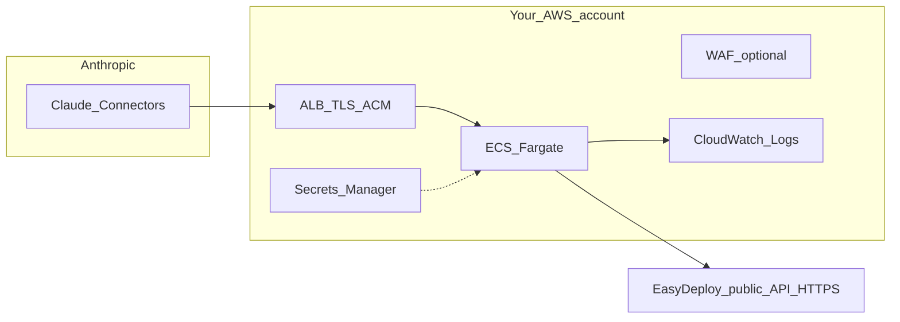

# AWS P0: remote EasyDeploy AI MCP

Lean reference deployment for **`easydeploy_ai_mcp.http_main:app`** behind TLS. Traffic flow:



## Endpoints

| Path | Purpose |
|------|---------|
| `GET /healthz` | Target group health check (JSON `{"status":"ok"}`). |
| `/mcp` | MCP over **Streamable HTTP** (FastMCP 3.x). Configure this URL in Claude **Connectors** or MCP clients that support HTTP. |

Confirm the exact path and transport with your pinned **FastMCP** version and [Anthropic remote MCP](https://support.claude.com/en/articles/11503834-building-custom-connectors-via-remote-mcp-servers) documentation.

## P0 checklist

| Area | Recommendation |
|------|----------------|
| TLS | Internet-facing **Application Load Balancer** with **ACM** certificate; redirect HTTP → HTTPS. |
| Secrets | Inject **`EDA_API_KEY`** (required) and optional **`MCP_SERVICE_TOKEN`** from **Secrets Manager** (or SSM SecureString). Add **`EDA_API_BASE`** only if you point at a non-production API (internal/staging). Never bake secrets into the image. |
| Network | Run tasks in **private subnets** without public IPs. Security group: allow inbound **only** from the ALB security group on the container port (e.g. 8080). |
| Observability | **CloudWatch Logs** driver for the task; structured logs; **do not** log API keys or full sensitive payloads. |
| Upstream | Default API host is production EasyDeploy; if you set `EDA_API_BASE`, it must be **https://** (enforced in `api_client`). |
| WAF vs clients | **WAF IP allowlist** for [Anthropic egress IPs](https://support.claude.com/en/articles/11503834-building-custom-connectors-via-remote-mcp-servers) reduces anonymous scanning if **all** production traffic is Claude **Connectors** (requests originate from Anthropic). That pattern **breaks** clients calling your URL **directly** from arbitrary IPs (e.g. some **Claude Code** setups). Choose **Connector-only + allowlist** **or** **broader access + `MCP_SERVICE_TOKEN`** (see README). |
| MCP auth | If not using IP restriction, set **`MCP_SERVICE_TOKEN`** and require `Authorization: Bearer …` on `/mcp`. `GET /healthz` stays unauthenticated for ALB health checks. |

## AWS components (minimal)

1. **ECR** repository for the container image.
2. **ECS cluster** + **Fargate** service (start with 1 task; scale on CPU/memory or request count).
3. **ALB** + target group → container port **8080** (or `PORT`); health check **HTTP GET `/healthz`**.
4. **IAM** task execution role: pull from ECR, read secrets. Task role: minimal (add only if the app calls AWS APIs).

## Image

Build from the **root of this repository** (the `easydeploy-ai-mcp` project):

```bash
docker build -t easydeploy-ai-mcp .
```

Push to ECR and reference the digest in the task definition.

## Infrastructure as code

If your organization uses a shared **infrastructure-as-code** repository (CDK, Terraform, Pulumi, etc.), you can add an ALB+Fargate (or equivalent) stack there for this service. **P0:** provision resources via the AWS Console, CLI, or a **small standalone** IaC project in **this** repo or your account until a shared module exists. **Follow-up:** promote a reusable stack into your org’s standard IaC library once the container image and ports are stable.

## Compliance (SOC 2)

**Hosting this MCP service on AWS** in an account and control framework you already use for regulated workloads is the **preferred** path for **SOC 2 Type I/II** alignment: you avoid adding a **new hosting subprocessor** for the MCP tier when you reuse **TLS, Secrets Manager, IAM, and CloudWatch** patterns that match your existing security documentation and auditor evidence.

Map this service in your **customer-facing architecture** and data-flow diagrams as **MCP (Fargate or equivalent) → EasyDeploy public API**, and document what transits the MCP layer (credentials, tool arguments, metadata). Tie the narrative to **your** SOC 2 control matrix and customer-facing security documentation—evidence auditors and customers can access—not to ad-hoc internal file paths.

**Third-party MCP platforms** (e.g. FastMCP Cloud / Prefect Horizon) can accelerate delivery but require **vendor due diligence** (SOC 2 report, DPA, data region, logging retention) as with any other subprocessor.
